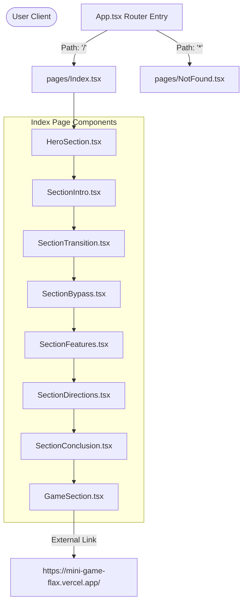
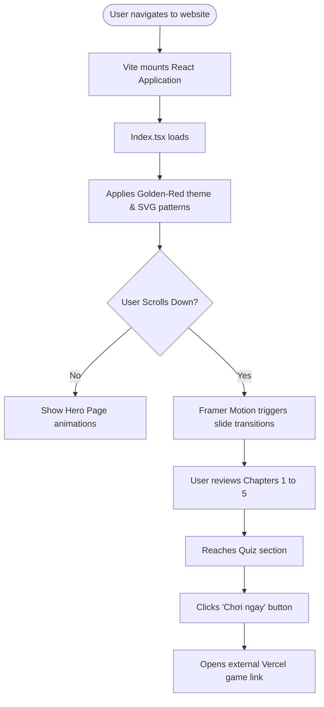
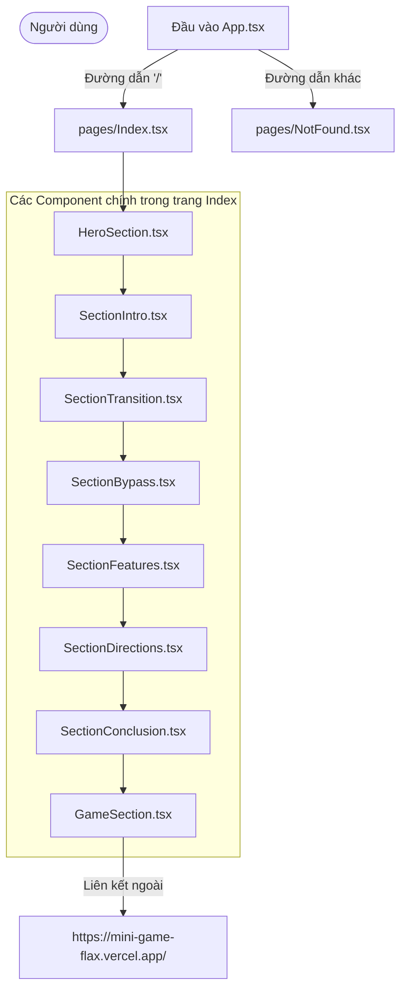
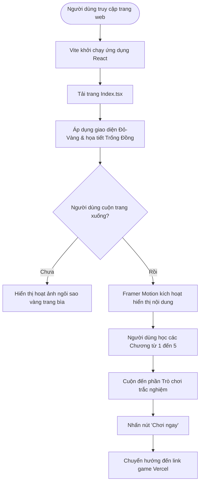

# FPTU MLN131: Con Đường Xã Hội (Scientific Socialism Presentation Hub)

An interactive, responsive, and aesthetically premium web-based presentation hub built for the **MLN131 (Scientific Socialism / Chủ nghĩa Xã hội Khoa học)** curriculum at FPT University. This application serves as an engaging digital slide deck detailing Chapter 3: *"The Transition to Socialism Bypassing Capitalism in Vietnam"* ("Quá độ lên Chủ nghĩa Xã hội bỏ qua chế độ Tư bản Chủ nghĩa ở Việt Nam").

---

#  English Version

## 1. Project Title
**Con Đường Xã Hội — Interactive Scientific Socialism Presentation Platform**

---

## 2. Project Overview
**Con Đường Xã Hội** (The Socialist Path) is a modern web-based presentation application designed to replace legacy presentation slides (like PowerPoint or Google Slides) with an immersive, animated, and interactive digital experience. Built for FPT University's **MLN131** course, the application presents the comprehensive curriculum of Chapter 3: *The transition period to socialism and the characteristics of bypassing capitalism in Vietnam*.

Unlike static documents, this platform leverages:
*   **Cultural-Theme Aesthetics:** Tailored design variables incorporating traditional Vietnamese flag red, warm gold tones, and custom vector patterns inspired by the Dong Son bronze drum (Trống Đồng Đông Sơn) and the national golden star.
*   **Motion-Driven Navigation:** Seamless animations that reveal academic content dynamically as the user scrolls, simulating a high-production slide transition.
*   **Gamified Learning:** Integration with a custom-built, external "Who Wants to Be a Millionaire" (Ai là triệu phú) trivia minigame centered around Scientific Socialism.

---

## 3. Executive Summary
Con Đường Xã Hội represents a technical upgrade to standard academic presentations. By using React, Vite, Framer Motion, and Tailwind CSS, the platform delivers a fast, responsive, and visually striking presentation client.

The application acts as a single-page interactive guide containing five distinct thematic parts plus a final gamified review. It is structured to help students deliver clear, impactful presentations to lecturers and peers. It avoids boring bullet-point blocks in favor of cards, interactive lists, side-by-side platform comparisons, and visual timeline milestones.

---

## 4. Key Features
*   **Aesthetic Cover Hub (Hero Section):** Features an animated scroll indicator, custom typography, and a spinning watermark of the national star.
*   **Interactive Presentation Sections:**
    *   *Part 1: Intro to Socialism:* Displays the four conceptual angles of socialism (practical movement, ideological trend, science, and social system) in hover-scalable cards.
    *   *Part 2: Inevitability & Features of the Transition Period:* Explores the direct vs. indirect transition pathways, conditions for emergence, and the 6 essential characteristics of socialism using quotes from Karl Marx and Vladimir Lenin.
    *   *Part 3: Bypassing Capitalism in Vietnam:* Visualizes the definition and the 4-part core contents of "bypassing capitalism" as defined in FPTU academic materials.
    *   *Part 4: Characteristics of Socialism in Vietnam:* Compares the 6 characteristics defined in the 1991 Platform vs. the 8 characteristics of the 2011 amended Platform, followed by a interactive progress timeline of national goals (2025, 2030, 2045).
    *   *Part 5: Directions & Relationships:* Details the 7 directions from the 1991 Platform, the XI Congress amendments, and the 8 key socio-economic relationships that must be managed.
*   **Integrated Mini-Game:** Connects to an external Vercel-hosted game interface ("Ai là triệu phú") containing a complete bank of MLN131-related review questions.
*   **Responsive Typography & Layouts:** Automatically reformats grid cards and headers for mobile screens, tablets, and wide monitors.

---

## 5. User Roles
As a public, static presentation platform, the application defines three functional user roles:

### 👤 Presenter / Student Group
*   **Purpose:** Delivers the group presentation in front of the class.
*   **Workflow:** Uses keyboard/mouse scrolls to reveal information step-by-step, guiding the audience through the animated curriculum.

### 🎓 Lecturer / Assessor
*   **Purpose:** Grades the group's slide deck layout, curriculum accuracy, and innovation.
*   **Workflow:** Evaluates the interactive elements, inspects citation notes from the FPTU syllabus, and reviews the integration of the gamified quiz.

### 👥 Learner / Peer Student
*   **Purpose:** Learns the course content at their own pace.
*   **Workflow:** Reads through the structured cards, reviews the 1991/2011 platform comparison tables, and clicks to play the review game to prepare for exams.

---

## 6. Use Cases
1.  **Classroom Presentation:** A student group opens the website on the projector, scrolls through sections 1-5, and explains the concepts of Scientific Socialism. The smooth entry animations keep the audience engaged.
2.  **Studying for MLN131 Exams:** A student opens the website to study the difference between the 1991 and 2011 Platforms. They scroll to Section 4.2 to see the side-by-side comparison, then click the "Chơi ngay" button to test themselves with the quiz.
3.  **Grading a Project:** The course lecturer inspects the website, reviews the source code, validates that FPT syllabus pages are accurately cited (e.g. pp. 86–87, 109–110), and grades the presentation.

---

## 7. System Architecture
The application runs as a lightweight, single-page client application with the following layout flow:



---

## 8. Technology Stack
*   **React (v18.3.1) & Vite (v5.4.19):** Serves as the component engine and development build environment.
*   **TypeScript (v5.8.3):** Enforces strict types across layouts and configurations.
*   **Tailwind CSS (v3.4.17) & PostCSS:** Provides styling and responsive utility classes.
*   **Framer Motion (v12.35.2):** Controls the entry transitions (`animate`), scroll-triggered triggers (`whileInView`), and spring physics.
*   **Radix UI & Shadcn boilerplate:** Standardized UI widgets (toaster, tooltip providers).
*   **Lucide React (v0.462.0):** Provides icons.
*   **Vitest (v3.2.4) & Playwright (v1.57.0):** Configured for unit testing and end-to-end browser assertions.

---

## 9. Project Structure
```text
fptu-mln131-con-duong-xa-hoi/
├── public/                    # Static assets
│   ├── favicon.ico            # Page icon
│   ├── placeholder.svg        # Stand-in graphic assets
│   └── robots.txt             # Search indexing rules
├── src/                       # Application source
│   ├── components/            # Visual layout blocks
│   │   ├── ui/                # Base Shadcn/Radix components
│   │   ├── HeroSection.tsx    # Slide cover page with scroll prompt
│   │   ├── SectionIntro.tsx   # Part 1: Definition of Socialism
│   │   ├── SectionTransition.tsx # Part 2: Historical Transition Period
│   │   ├── SectionBypass.tsx  # Part 3: Bypassing Capitalism logic
│   │   ├── SectionFeatures.tsx # Part 4: Platform comparisons & Milestones
│   │   ├── SectionDirections.tsx # Part 5: 7 Directions & 8 Relations
│   │   ├── SectionConclusion.tsx # Thank you slide
│   │   ├── GameSection.tsx    # Quiz redirect card
│   │   └── NavLink.tsx        # Inline link layouts
│   ├── hooks/                 # Mobile check and toast controllers
│   ├── lib/                   # Theme classes and helpers
│   ├── pages/                 # Full-screen pages (Index, NotFound)
│   ├── styles/                # CSS variable declarations
│   ├── App.tsx                # Routing rules & providers
│   └── main.tsx               # DOM Mounting script
├── package.json               # Scripts & dependencies manifest
├── tailwind.config.ts         # Theme variables (colors, fonts, animations)
├── vite.config.ts             # Development proxy & plugin config
└── playwright.config.ts       # Browser test automation setup
```

---

## 10. Core Business Logic
*   **Transition Engine:** Leverages Framer Motion viewport triggers:
    ```typescript
    const fadeIn = {
      hidden: { opacity: 0, y: 20 },
      visible: { opacity: 1, y: 0, transition: { duration: 0.6 } },
    };
    ```
    This block is attached to elements as `<motion.div variants={fadeIn} whileInView="visible" viewport={{ once: true }}>`, providing a native app slide transition feel.
*   **Dong Son Theme Injection:** Custom CSS classes (`drum-pattern-bg`, `star-pattern`) inject responsive SVG patterns dynamically as CSS background properties, keeping DOM size to a minimum.
*   **Dual-Platform Comparison Rules:** Structures the features comparison into structured rows that wrap gracefully on mobile devices.

---

## 11. Database Design
This application is a static, client-side web presentation platform and does not implement a database. All presentation text, quotes, and structural relationships are loaded client-side via React component hooks.

---

## 12. API Documentation
The application operates entirely on the client-side and does not call any internal REST API endpoints. 

### External Integrations:
*   **Minigame Redirect Link:** `https://mini-game-flax.vercel.app/`
    *   **Method:** `GET` (Window target redirect)
    *   **Purpose:** Launces the interactive "Ai là triệu phú" trivia review session.

---

## 13. Authentication & Authorization
This application is open-access to ensure ease of presentation in FPT University classes and does not require account creation, login credentials, or token-based authorization.

---

## 14. Application Workflow



---

## 15. Installation Guide

### Prerequisites
*   **Node.js:** v18.x or v20.x
*   **Package Manager:** Bun (Recommended) or npm

### Installation Steps
1.  **Clone the Repository:**
    ```bash
    git clone https://github.com/nmbt2910/fptu-mln131-con-duong-xa-hoi.git
    cd fptu-mln131-con-duong-xa-hoi
    ```
2.  **Install Dependencies:**
    ```bash
    bun install
    # or
    npm install
    ```
3.  **Start Development Server:**
    ```bash
    bun run dev
    # or
    npm run dev
    ```
    Open `http://localhost:8080` or `http://localhost:5173` (depending on local port allocation) in your browser.

4.  **Run Tests:**
    ```bash
    # Run unit tests
    bun run test
    
    # Run end-to-end tests
    npx playwright test
    ```

5.  **Build Production Assets:**
    ```bash
    bun run build
    # or
    npm run build
    ```

---

## 16. Configuration
*   `tailwind.config.ts`: Customizes fonts (`Playfair Display`, `Be Vietnam Pro`, `Crimson Text`) and defines color mappings matching the traditional Vietnamese flag colors (soft red, warm gold).
*   `vite.config.ts`: Maps the dev server configuration and configures SWC compilation plugins.
*   `components.json`: Configures Shadcn UI imports and paths setup.

---

## 17. Development Guide
*   **Coding Standards:** Use TypeScript interfaces for any structural data arrays. Keep UI elements isolated under `src/components/`.
*   **Styling Standards:** Avoid custom CSS stylesheets. Leverage Tailwind CSS utilities combined with custom tokens defined in `src/index.css`.
*   **Animation Guidelines:** All motion wrappers must include the `viewport={{ once: true }}` flag to prevent jarring loops when scrolling up and down.

---

## 18. Future Enhancements
*   **Interactive Quiz Embed:** Embed the Vercel-hosted game directly as an iframe or React component, avoiding external tabs.
*   **Offline Mode PWA:** Convert the app to a Progressive Web App (PWA) so it can run offline in FPT classrooms with unstable internet connection.
*   **Presentation Remote Control:** Connect to a smartphone client via WebSockets (Socket.io) to turn the phone into a slide remote clicker.

---

## 19. Known Limitations
*   **Static Assets:** Content modifications require direct edits to the React JSX templates.
*   **No CMS Integration:** The project lacks a content management system or database for adding slide content.

---

## 20. Conclusion
Con Đường Xã Hội serves as a high-fidelity, interactive alternative to legacy slide decks for FPT University's MLN131 curriculum. Built on React and Framer Motion, it offers a seamless reading and presentation flow, helping students deliver engaging presentations with modern technology.

---

#  Phiên Bản Tiếng Việt

## 1. Tiêu Đề Dự Án
**Con Đường Xã Hội — Nền Tảng Trình Chiếu Tương Tác Môn Chủ Nghĩa Xã Hội Khoa Học**

---

## 2. Tổng Quan Dự Án
**Con Đường Xã Hội** là ứng dụng trình chiếu tương tác trực quan trên nền tảng web, được xây dựng để thay thế các slide bài giảng truyền thống (như PowerPoint hay Google Slides) bằng một trải nghiệm số sống động, trực quan và giàu hoạt ảnh. Được thiết kế chuyên biệt cho môn học **MLN131 (Chủ nghĩa Xã hội Khoa học)** tại Đại học FPT, ứng dụng truyền tải toàn bộ kiến thức cốt lõi của Chương 3: *Thời kỳ quá độ lên chủ nghĩa xã hội và đặc điểm bỏ qua chế độ tư bản chủ nghĩa ở Việt Nam*.

Không còn những khối văn bản tĩnh nhàm chán, nền tảng sở hữu:
*   **Thẩm Mỹ Đậm Đà Bản Sắc:** Hệ thống biến màu tùy chỉnh lấy cảm hứng từ màu đỏ cờ Tổ quốc, sắc vàng ấm, đi kèm các mẫu SVG chìm của Trống Đồng Đông Sơn và ngôi sao vàng năm cánh.
*   **Điều Hướng Chuyển Động (Motion Navigation):** Các hiệu ứng hoạt ảnh xuất hiện mượt mà theo tiến trình cuộn trang của người dùng, mang lại cảm giác chuyên nghiệp như một buổi trình diễn slide cao cấp.
*   **Học Tập Tương Tác:** Tích hợp liên kết trò chơi trắc nghiệm tương tác "Ai là triệu phú" chứa hệ thống câu hỏi củng cố kiến thức môn học.

---

## 3. Báo Cáo Tóm Tắt (Executive Summary)
Con Đường Xã Hội là một bước cải tiến công nghệ vượt trội dành cho các bài thuyết trình học thuật. Bằng việc sử dụng React, Vite, Framer Motion và Tailwind CSS, dự án mang lại một giao diện trình chiếu tốc độ cao, tương thích tốt với nhiều thiết bị và có tính thẩm mỹ vượt trội.

Ứng dụng đóng vai trò là một cẩm nang số tương tác được chia làm 5 phần bài học và 1 phần ôn tập trò chơi. Cấu trúc nội dung được tối ưu hóa giúp các bạn sinh viên dễ dàng truyền đạt kiến thức đến giảng viên và tập thể lớp học thông qua thẻ thông tin, bảng so sánh trực quan và các mốc dòng thời gian phát triển đất nước.

---

## 4. Các Tính Năng Cốt Lõi
*   **Trang Bìa Ấn Tượng (Hero Section):** Hoạt ảnh chỉ dẫn cuộn trang, chữ nghệ thuật và hình ảnh chìm chuyển động của ngôi sao vàng năm cánh.
*   **Các Phần Nội Dung Tương Tác:**
    *   *Phần 1: Giới thiệu về Chủ nghĩa Xã hội:* Tiếp cận 4 góc độ của CNXH (phong trào thực tiễn, trào lưu tư tưởng, khoa học và chế độ xã hội) qua các thẻ hover phóng to.
    *   *Phần 2: Tính tất yếu & Đặc điểm thời kỳ quá độ:* Phân tích luồng quá độ trực tiếp/gián tiếp, điều kiện ra đời và 6 đặc trưng bản chất của CNXH theo Mác - Lênin với các trích dẫn danh ngôn của C. Mác và V.I. Lênin.
    *   *Phần 3: Bỏ qua chế độ Tư bản Chủ nghĩa ở Việt Nam:* Trực quan hóa định nghĩa và 4 nội dung cốt lõi của việc "bỏ qua chế độ tư bản chủ nghĩa" theo giáo trình chuẩn Đại học FPT.
    *   *Phần 4: Đặc trưng Chủ nghĩa Xã hội ở Việt Nam:* Bảng so sánh trực quan giữa 6 đặc trưng (Cương lĩnh 1991) và 8 đặc trưng (Cương lĩnh bổ sung 2011), kèm theo dòng thời gian mục tiêu phát triển quốc gia (2025, 2030, 2045).
    *   *Phần 5: Phương hướng xây dựng và Kết luận:* Chi tiết 7 phương hướng (Cương lĩnh 1991), bổ sung Đại hội XI và 8 mối quan hệ lớn cần giải quyết.
*   **Tích Hợp Trò Chơi Ôn Tập:** Kết nối đến mini-game trắc nghiệm "Ai là triệu phú" được lưu trữ riêng trên máy chủ Vercel nhằm phục vụ mục đích ôn tập lý thuyết cuối kỳ.
*   **Tương Thích Mọi Thiết Bị (Responsive):** Tự động điều chỉnh bố cục chữ và thẻ lưới hiển thị mượt mà từ màn hình điện thoại di động, máy tính bảng đến màn hình trình chiếu máy tính.

---

## 5. Các Vai Trò Người Dùng
Là một website thuyết trình công cộng và tĩnh, ứng dụng phục vụ ba nhóm vai trò chính:

### 👤 Người Thuyết Trình / Nhóm Sinh Viên
*   **Mục đích:** Thực hiện bài thuyết trình trước tập thể lớp học.
*   **Quyền hạn & Luồng hoạt động:** Sử dụng thao tác cuộn chuột/bàn phím để mở dần thông tin bài thuyết trình theo tiến trình giảng bài.

### 🎓 Giảng Viên / Người Đánh Giá
*   **Mục đích:** Chấm điểm, đánh giá mức độ đầu tư, tính chính xác và sáng tạo của bài thuyết trình.
*   **Quyền hạn & Luồng hoạt động:** Kiểm tra cấu trúc bài học, các trang giáo trình được trích dẫn (ví dụ: Trang 86-87, 109-110) và chấm điểm phần tích hợp game tương tác.

### 👥 Người Học / Sinh Viên Khác
*   **Mục đích:** Tự ôn tập kiến thức môn học.
*   **Quyền hạn & Luồng hoạt động:** Đọc các thẻ thông tin tóm tắt, tra cứu bảng so sánh Cương lĩnh và click tham gia chơi game trắc nghiệm để củng cố kiến thức thi cử.

---

## 6. Các Kịch Bản Sử Dụng (Use Cases)
1.  **Thuyết Trình Trên Lớp:** Nhóm sinh viên mở trang web trên máy chiếu của giảng đường, cuộn qua từng phần bài học để trình bày nội dung. Hoạt ảnh xuất hiện mượt mà giúp buổi thuyết trình sinh động, thu hút sự chú ý.
2.  **Ôn Thi Cuối Kỳ Môn MLN131:** Sinh viên truy cập trang web để học sự khác nhau giữa hai Cương lĩnh 1991 và 2011. Họ chỉ cần cuộn đến Phần 4.2 để xem bảng đối chiếu nhanh, sau đó nhấn "Chơi ngay" để luyện đề thi thử qua trò chơi trắc nghiệm.
3.  **Kiểm Tra & Đánh Giá Bài Tập:** Giảng viên bộ môn mở trang web, kiểm tra chất lượng mã nguồn, xác thực thông tin trích dẫn từ giáo trình chính thức và ghi nhận điểm số cho nhóm sinh viên thiết kế dự án.

---

## 7. Kiến Trúc Hệ Thống
Ứng dụng chạy độc lập dưới dạng Single Page Application (SPA) trên trình duyệt với luồng cấu trúc như sau:



---

## 8. Công Nghệ Sử Dụng
*   **React (v18.3.1) & Vite (v5.4.19):** Nền tảng phát triển ứng dụng và đóng gói bản build production.
*   **TypeScript (v5.8.3):** Kiểm soát kiểu dữ liệu chặt chẽ cho toàn bộ cấu trúc dự án.
*   **Tailwind CSS (v3.4.17):** Hỗ trợ viết mã CSS nhanh chóng và xây dựng giao diện tương thích thiết bị di động.
*   **Framer Motion (v12.35.2):** Xử lý hoạt ảnh mượt mà, chuyển cảnh xuất hiện khi cuộn trang và các tương tác lò xo.
*   **Radix UI & Shadcn:** Bộ công cụ xây dựng các thành phần thông báo (Toaster) và gợi ý (Tooltip).
*   **Lucide React (v0.462.0):** Thư viện icons vector chất lượng cao.
*   **Vitest (v3.2.4) & Playwright (v1.57.0):** Môi trường chạy các bài kiểm thử đơn vị (Unit test) và kiểm thử trình duyệt tự động (End-to-End).

---

## 9. Cấu Trúc Thư Mục Dự Án
```text
fptu-mln131-con-duong-xa-hoi/
├── public/                    # Tài nguyên tĩnh của ứng dụng
│   ├── favicon.ico            # Biểu tượng trang web
│   ├── placeholder.svg        # Ảnh đồ họa thay thế tạm thời
│   └── robots.txt             # Quy định lập chỉ mục tìm kiếm
├── src/                       # Thư mục mã nguồn chính
│   ├── components/            # Các khối giao diện trình chiếu
│   │   ├── ui/                # Các thành phần giao diện nhỏ của Shadcn/Radix
│   │   ├── HeroSection.tsx    # Trang bìa mở đầu bài thuyết trình
│   │   ├── SectionIntro.tsx   # Phần 1: Các góc độ định nghĩa CNXH
│   │   ├── SectionTransition.tsx # Phần 2: Tính tất yếu thời kỳ quá độ
│   │   ├── SectionBypass.tsx  # Phần 3: Định nghĩa bỏ qua CNTB ở Việt Nam
│   │   ├── SectionFeatures.tsx # Phần 4: So sánh Cương lĩnh & Cột mốc 2045
│   │   ├── SectionDirections.tsx # Phần 5: 7 phương hướng và 8 mối quan hệ lớn
│   │   ├── SectionConclusion.tsx # Lời cảm ơn kết thúc bài thuyết trình
│   │   ├── GameSection.tsx    # Thẻ điều hướng chơi game trắc nghiệm
│   │   └── NavLink.tsx        # Cấu trúc liên kết nội bộ
│   ├── hooks/                 # Bộ kiểm tra kích thước mobile và điều khiển thông báo
│   ├── lib/                   # Thư viện xử lý định dạng classes giao diện
│   ├── pages/                 # Các trang toàn màn hình (Index, NotFound)
│   ├── styles/                # Định nghĩa biến chủ đề CSS
│   ├── App.tsx                # Quản lý định tuyến và nhà cung cấp
│   └── main.tsx               # Khởi chạy DOM chính
├── package.json               # Khai báo thư viện và lệnh chạy dự án
├── tailwind.config.ts         # Cấu hình màu sắc đỏ-vàng chủ đạo và fonts chữ
├── vite.config.ts             # Cấu hình môi trường phát triển Vite
└── playwright.config.ts       # Cấu hình kiểm thử trình duyệt tự động
```

---

## 10. Logic Nghiệp Vụ Cốt Lõi
*   **Cơ Chế Chuyển Cảnh Khi Cuộn:** Tận dụng bộ kích hoạt viewport của Framer Motion:
    ```typescript
    const fadeIn = {
      hidden: { opacity: 0, y: 20 },
      visible: { opacity: 1, y: 0, transition: { duration: 0.6 } },
    };
    ```
    Hàm này được áp dụng vào thẻ JSX `<motion.div variants={fadeIn} whileInView="visible" viewport={{ once: true }}>` giúp các phần nội dung xuất hiện tự nhiên khi lướt màn hình tới vùng hiển thị.
*   **Nhúng Họa Tiết Trống Đồng:** Các class CSS tùy chỉnh (`drum-pattern-bg`, `star-pattern`) nhúng mã SVG của Trống Đồng và Ngôi Sao trực tiếp vào thuộc tính hình nền CSS, giảm thiểu dung lượng tải trang.
*   **So Sánh Cương Lĩnh:** Bố cục dữ liệu được xây dựng dưới dạng bảng tự động gom cột (flex-grid), giúp hiển thị rõ ràng trên máy tính và tự động kéo dài theo chiều dọc trên điện thoại.

---

## 11. Thiết Kế Cơ Sở Dữ Liệu
Ứng dụng này là một trang web thuyết trình tĩnh chạy ở phía client và không tích hợp cơ sở dữ liệu. Tất cả thông tin bài học, danh ngôn và cấu trúc định tuyến được tải trực tiếp từ bộ nhớ tạm thời của các linh kiện React.

---

## 12. Tài Liệu API
Ứng dụng chạy hoàn toàn ở phía client và không thực hiện cuộc gọi API REST nội bộ nào.

### Liên Kết Dịch Vụ Ngoài:
*   **Liên kết chuyển hướng game:** `https://mini-game-flax.vercel.app/`
    *   **Phương thức:** `GET` (Mở liên kết ở tab mới)
    *   **Mục đích:** Kích hoạt giao diện chơi game trắc nghiệm "Ai là triệu phú" ôn tập môn học.

---

## 13. Xác Thực Và Phân Quyền
Ứng dụng được thiết lập mở rộng công khai để đảm bảo giảng viên và sinh viên có thể truy cập trình chiếu nhanh chóng trên giảng đường mà không cần đăng ký tài khoản, đăng nhập hay cấp mã token bảo mật.

---

## 14. Luồng Hoạt Động Ứng Dụng



---

## 15. Hướng Dẫn Cài Đặt

### Yêu Cầu Hệ Thống
*   **Node.js:** Phiên bản 18.x hoặc 20.x trở lên.
*   **Trình Quản Lý Gói:** Sử dụng Bun (Khuyến khích) hoặc npm.

### Các Bước Cài Đặt
1.  **Tải Mã Nguồn:**
    ```bash
    git clone https://github.com/nmbt2910/fptu-mln131-con-duong-xa-hoi.git
    cd fptu-mln131-con-duong-xa-hoi
    ```
2.  **Cài Đặt Thư Viện:**
    ```bash
    bun install
    # hoặc
    npm install
    ```
3.  **Khởi Động Môi Trường Phát Triển Cục Bộ:**
    ```bash
    bun run dev
    # hoặc
    npm run dev
    ```
    Mở địa chỉ `http://localhost:8080` hoặc `http://localhost:5173` trên trình duyệt web của bạn.

4.  **Chạy Thử Nghiệm Kiểm Thử:**
    ```bash
    # Chạy unit test
    bun run test
    
    # Chạy e2e test với Playwright
    npx playwright test
    ```

5.  **Biên Dịch Đóng Gói Dự Án (Production):**
    ```bash
    bun run build
    # hoặc
    npm run build
    ```

---

## 16. Cấu Hình
*   `tailwind.config.ts`: Cấu hình chủ đề thiết kế với phông chữ Việt hóa (`Playfair Display`, `Be Vietnam Pro`, `Crimson Text`) và bộ mã màu cờ Tổ quốc.
*   `vite.config.ts`: Thiết lập máy chủ phát triển cục bộ và trình cắm SWC biên dịch nhanh.
*   `components.json`: Khai báo thư viện Shadcn UI.

---

## 17. Hướng Dẫn Phát Triển
*   **Quy Chuẩn Code:** Sử dụng TypeScript chặt chẽ cho các mảng dữ liệu văn bản. Phân tách các phần slide thành các linh kiện riêng trong thư mục `src/components/`.
*   **Quy Chuẩn Giao Diện:** Không viết mã CSS thuần tùy tiện. Hãy tận dụng tối đa các class tiện ích của Tailwind CSS kết hợp với các biến chủ đề tại `src/index.css`.
*   **Hoạt Ảnh:** Mọi linh kiện chuyển động phải có gắn thuộc tính `viewport={{ once: true }}` để tránh lặp lại hoạt ảnh gây rối mắt khi cuộn trang lên xuống.

---

## 18. Kế Hoạch Phát Triển Tương Lai
*   **Nhúng Trực Tiếp Trò Chơi:** Đưa giao diện game trắc nghiệm chạy trực tiếp bên trong trang web thay vì mở một tab trình duyệt mới.
*   **Chế Độ Ngoại Tuyến PWA:** Nâng cấp ứng dụng thành Progressive Web App giúp trình chiếu ổn định trên giảng đường Đại học FPT ngay cả khi không có kết nối Internet.
*   **Điều Khiển Trình Chiếu:** Kết nối WebSocket với điện thoại thông minh để biến điện thoại thành thiết bị điều khiển chuyển slide từ xa.

---

## 19. Hạn Chế Hiện Tại
*   **Tài Nguyên Tĩnh:** Mọi thay đổi về nội dung bài giảng cần được cập nhật trực tiếp vào mã nguồn React JSX.
*   **Không Có CMS:** Hệ thống chưa hỗ trợ công cụ quản trị nội dung hay cơ sở dữ liệu để tự thêm bài thuyết trình mới.

---

## 20. Kết Luận
Con Đường Xã Hội là một giải pháp công nghệ thay thế hiện đại và đầy sáng tạo cho các bài trình chiếu truyền thống của môn học MLN131 tại Đại học FPT. Được tối ưu hóa bằng React và Framer Motion, ứng dụng đem lại trải nghiệm học tập và thuyết trình mượt mà, giúp sinh viên tiếp cận kiến thức học thuật một cách trực quan và thu hút hơn.
